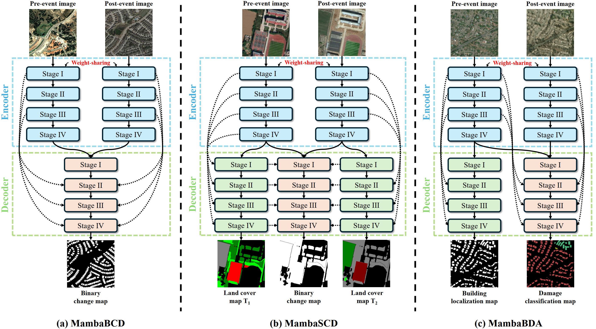

<div align="center">
<h1>ChangeMamba </h1>
<h3>ChangeMamba: Remote Sensing Change Detection with Spatio-Temporal State Space Model</h3>

[Hongruixuan Chen](https://scholar.google.ch/citations?user=XOk4Cf0AAAAJ&hl=zh-CN&oi=ao)<sup>1</sup>,[Jian Song](https://scholar.google.ch/citations?user=CgcMFJsAAAAJ&hl=zh-CN)<sup>1,2</sup>,[Chengxi Han](https://scholar.google.com/citations?user=8ZED-EwAAAAJ&hl=en)<sup>3</sup>, [Junshi Xia](https://scholar.google.com/citations?user=n1aKdTkAAAAJ&hl=en)<sup>2</sup>, [Naoto Yokoya](https://scholar.google.co.jp/citations?user=DJ2KOn8AAAAJ&hl=en)<sup>1,2</sup>

<sup>1</sup> The University of Tokyo, <sup>2</sup> RIKEN AIP,  <sup>3</sup> Wuhan University.
</div>

##  Updates
* **` Notice`**: This repository is being updated! The code and weights for the trained models will be released soon! We'd appreciate it if you could give this repo a ⭐️ and stay tuned!
* **` April. 04th, 2024`**: The models and training code for MambaBCD have been organized and uploaded. Feel free to use it!

## Overview 

* [**ChangeMamba**](https://chrx97.com/Files/MambaCD.pdf) serves as a strong benchmark for change detection tasks, including binary change detection (MambaBCD), semantic change detection (MambaSCD), and building damage assessment (MambaBDA). 

<p align="center">
  
</p>

* **Spatio-temporal relationship learning methods of ChangeMamba**

<p align="center">
  
</p>

## Main Results

* *The encoders for all the above ChangeMamba models are the the VMamba architecture initialized with ImageNet pre-trained weight.*
### **Binary Change Detection on WHU-CD**
| Method |  Overall Accuracy | F1 Score | IoU | Kappa Coefficient | Param | GFLOPs | ckpts
| :---: | :---: | :---: | :---: | :---: | :---: | :---: | :---: |
| [FC-EF](https://arxiv.org/abs/1810.08462) | 98.87  | 84.89  | 73.74  | 84.30 | 17.13 | 45.74 | -- |
| [SNUNet](https://github.com/likyoo/Siam-NestedUNet) |  99.10  | 87.70 | 78.09 |  87.23 | 10.21  | 176.36 | -- |
| [DSIFN](https://github.com/GeoZcx/A-deeply-supervised-image-fusion-network-for-change-detection-in-remote-sensing-images) | 99.31  |  89.91| 81.67| 89.56 |  35.73 | 329.03 | -- |
| [SiamCRNN-101](https://github.com/ChenHongruixuan/SiamCRNN/tree/master/FCN_version) | 99.19 | 89.10 | 80.34 | 88.68 | 63.44 | 224.30  | -- |
| [HANet](https://github.com/ChengxiHAN) |  99.16 | 88.16 | 78.82 | 87.72 | 2.61  | 70.68 | -- |
| [CGNet](https://github.com/ChengxiHAN/CGNet-CD) |  99.48 | 92.59 | 86.21 | 92.33 | 33.68 | 329.58 | -- |
| [TransUNetCD](https://ieeexplore.ieee.org/document/9761892) |  99.09 | 87.79 | 78.44 | 87.44 | 28.37 | 244.54 | -- |
| [SwinSUNet](https://ieeexplore.ieee.org/document/9736956) |  99.50 | 93.04 | 87.00 | 92.78 | 39.28 | 43.50 | -- |
| [ChangeFormer V4](https://github.com/wgcban/ChangeFormer) |  99.10 | 87.39 | 77.61 | 86.93 | 33.61 | 852.53 | -- |
| [BIT-101](https://github.com/justchenhao/BIT_CD) |  99.27 | 90.04 | 81.88 | 89.66 | 17.13 | 45.74 | -- |
| MambaBCD-Tiny |  99.52 | 93.33 | 87.49 | 93.08 | 17.13 | 45.74 | -- |
| MambaBCD-Small |  99.57 | 94.06 | 88.79 | 93.84 | 49.94 | 114.82 | -- |
| MambaBCD-Base |  99.58 | 94.19 | 89.02 | 93.98 | 84.70 | 179.32 | -- |


### **Semantic Change Detection on SECOND**
| Method |  Overall Accuracy | F1 Score | IoU | SeK | Param | GFLOPs | ckpts
| :---: | :---: | :---: | :---: | :---: | :---: | :---: | :---: |
| [HRSCD-S1](https://www.sciencedirect.com/science/article/abs/pii/S1077314219300992) | 45.77 | 38.44 | 62.72   | 5.90   | 3.36   | 8.02 | -- |
| [HRSCD-S2](https://www.sciencedirect.com/science/article/abs/pii/S1077314219300992) | 85.49 | 49.22  |  64.43  | 10.69 | 6.39 |  14.29 | -- |
| [HRSCD-S3](https://www.sciencedirect.com/science/article/abs/pii/S1077314219300992) | 84.62 |  51.62  | 66.33  | 11.97|  12.77|   42.67 | -- |
| [HRSCD-S4](https://www.sciencedirect.com/science/article/abs/pii/S1077314219300992) | 86.62   |58.21  | 71.15  |  18.80 | 13.71 |  43.69| -- |
| [ChangeMask](https://www.sciencedirect.com/science/article/abs/pii/S0924271621002835) | 86.93  | 59.74  | 71.46 |  19.50 | 2.97 | 37.16 | -- |
| [SSCD-1](https://github.com/ggsDing/Bi-SRNet) | 87.19 | 61.22 |  72.60 |  21.86 |  23.39|  189.91 | -- |
| [Bi-SRNet](https://github.com/ggsDing/Bi-SRNet) |   87.84 | 62.61  | 73.41  | 23.22 | 19.44  | 63.72 | -- |
| [TED](https://github.com/ggsDing/SCanNet) | 87.39  | 60.34   | 72.79  | 22.17 | 42.16 | 75.79  | -- |
| [SMNet](https://www.mdpi.com/2072-4292/15/4/949) | 86.68 | 60.34   | 71.95 |  20.29 | 19.44  | 63.72 | -- |
| [ScanNet](https://github.com/ggsDing/SCanNet) | 87.86  | 63.66 |  73.42  | 23.94 | 27.90 | 264.95  | -- |
| MambaSCD-Tiny |  87.22  | 60.92  | 72.18  | 20.92 | 19.44  | 63.72 | -- |
| MambaSCD-Small | 88.38  | 64.10  | 73.61  | 24.04 | 51.82  | 137.10 | -- |
| MambaSCD-Base | 88.00 |  63.98  | 73.47  | 23.94 | 87.47 |  201.85| -- |


### **Building Damage Assessment on xBD**
| Method |  F1_loc | F1_clf  | F1_oa | F1_no | F1_minor | F1_major | F1_des | Param | GFLOPs | ckpts
| :---: | :---: | :---: | :---: | :---: | :---: | :---: | :---: |  :---: | :---: | :---: | 
| [xView2 Baseline](https://github.com/DIUx-xView/xView2_baseline) | 80.47 | 3.42 | 26.54 | 66.31 | 14.35 | 0.94 | 46.57 | -- | -- | -- |
| Siamese-UNet | 85.92  | 65.58  | 71.68  | 86.74 |  50.02  | 64.43 |  71.68 | -- | -- | -- |
| [MaskRCNN](https://arxiv.org/abs/2004.05525) |  83.60 | 70.02 | 74.10 | 90.60 | 49.30 | 72.20 | 83.70 | -- | -- | -- |
| [ChangeOS-101](https://github.com/Z-Zheng/ChangeOS) |  85.69 | 71.14 | 75.50 | 89.11 | 53.11 | 72.44 | 80.79 | -- | -- | -- |
| [ChangeOS-101-PPS](https://github.com/Z-Zheng/ChangeOS) |  85.69 | 75.44 | 78.52 | 92.81 | 59.38 | 74.65 | 83.29 | -- | -- | -- |
| [DamFormer](https://arxiv.org/abs/2201.10953) |  86.86 |72.81 |77.02 |89.86 |56.78| 72.56 |80.51 | -- | -- | -- |
| MambaBDA-Tiny |  84.76 | 77.50  | 79.68  | 95.33  | 60.15 | 75.94  | 88.27 | -- | -- | -- |
| MambaBDA-Small | 86.61 | 78.80 | 81.14 | 95.99| 62.82| 76.26| 88.37 | -- | -- | -- |
| MambaBDA-Base | 87.38 | 78.84| 81.41 |95.94 |62.74| 76.46 | 88.58 | -- | -- | -- |


## Let's Get Started!
### A. Installation
The repo is based on the [VMama repo](https://github.com/MzeroMiko/VMamba), thus you need to install it first. The following installation sequence is taken from the VMamba repo. Also, note that the code in this repo runs under Linux system. We have not tested whether it works under other OS.

**Step 1: Clone the repository:**

Clone this repository and navigate to the project directory:
```bash
git clone https://github.com/ChenHongruixuan/MambaCD.git
cd MambaCD
```


**Step 2: Environment Setup:**

It is recommended to set up a conda environment and installing dependencies via pip. Use the following commands to set up your environment:

***Create and activate a new conda environment***

```bash
conda create -n changemamba
conda activate changemamba
```

***Install dependencies***

```bash
pip install -r requirements.txt
cd kernels/selective_scan && pip install .
```


***Dependencies for `Detection` and `Segmentation` (optional in VMamba)***

```bash
pip install mmengine==0.10.1 mmcv==2.1.0 opencv-python-headless ftfy regex
pip install mmdet==3.3.0 mmsegmentation==1.2.2 mmpretrain==1.2.0
```
### B. Download Pretrained Weight
Also, please download the pretrained weights of [VMamba-Tiny](https://github.com/MzeroMiko/VMamba/releases/download/%2320240316/vssm_tiny_0230_ckpt_epoch_262.pth), [VMamba-Small](https://github.com/MzeroMiko/VMamba/releases/download/%2320240316/vssm_small_0229_ckpt_epoch_222.pth), and [VMamba-Base](https://github.com/MzeroMiko/VMamba/releases/download/%2320240316/vssm_base_0229_ckpt_epoch_237.pth) and put them under 
```bash
project_path/MambaCD/pretrained_weight/
```

### C. Data Preparation
***Binary change detection***

The three datasets [SYSU](https://github.com/liumency/SYSU-CD), [LEVIR-CD+](https://chenhao.in/LEVIR/) and [WHU-CD](https://study.rsgis.whu.edu.cn/pages/download/building_dataset.html) are used for binary change detection experiments. Please download them and make them have the following folder/file structure:
```
${DATASET_ROOT}   # Dataset root directory, for example: /home/username/data/SYSU
├── train
│   ├── T1
│   │   ├──00001.png
│   │   ├──00002.png
│   │   ├──00003.png
│   │   ...
│   │
│   ├── T2
│   │   ├──00001.png
│   │   ... 
│   │
│   └── GT
│       ├──00001.png 
│       ...   
│   
├── test
│   ├── ...
│   ...
│  
├── train.txt   # Data name list, recording all the names of training data
└── test.txt    # Data name list, recording all the names of testing data
```

***Semantic change detection***

The [SECOND dataset](https://captain-whu.github.io/SCD/) is used for semantic change detection experiments. Please download it and make it have the following folder/file structure:

```
${DATASET_ROOT}   # Dataset root directory, for example: /home/username/data/SECOND
├── train
│   ├── T1
│   │   ├──00001.png
│   │   ├──00002.png
│   │   ├──00003.png
│   │   ...
│   │
│   ├── T2
│   │   ├──00001.png
│   │   ... 
│   │
│   ├── GT_CD   # Binary change map
│   │   ├──00001.png 
│   │   ... 
│   │
│   ├── GT_T1   # Land-cover map of T1
│   │   ├──00001.png 
│   │   ...  
│   │
│   └── GT_T2   # Land-cover map of T2
│       ├──00001.png 
│       ...  
│   
├── test
│   ├── ...
│   ...
│ 
├── train.txt
└── test.txt
```

***Building damage assessment***

The xBD dataset can be downloaded from [xView 2 Challenge website](https://xview2.org/dataset). After downloading it, please organize it into the following structure: 
```
${DATASET_ROOT}   # Dataset root directory, for example: /home/username/data/xBD
├── train
│   ├── images
│   │   ├──guatemala-volcano_00000000_pre_disaster.png
│   │   ├──guatemala-volcano_00000000_post_disaster.png
│   │   ...
│   │
│   └── masks
│       ├──guatemala-volcano_00000003_pre_disaster.png
│       ├──guatemala-volcano_00000003_post_disaster.png
│       ... 
│   
├── test
│   ├── ...
│   ...
│
├── holdout
│   ├── ...
│   ...
│
├── train.txt # Data name list, recording all the names of training data
├── test.txt  # Data name list, recording all the names of testing data
└── holdout.txt  # Data name list, recording all the names of holdout data
```


### D. Model Training and Inference
Before training and testing models, please enter into changedetection folder
```bash
cd <project_path>/MambaCD/changedetection
```

***Binary change detection***

The following commands show how to train MambaBCD-Small on the SYSU dataset:
```bash
python script/train_MambaBCD.py  --dataset 'SYSU' \
                                 --batch_size 12 \
                                 --crop_size 256 \
                                 --max_iters 240000 \
                                 --train_dataset_path '<dataset_path>/SYSU/train' \
                                 --train_data_list_path '<dataset_path>/SYSU/train_list.txt' \
                                 --test_dataset_path '<dataset_path>/SYSU/test' \
                                 --test_data_list_path '<dataset_path>/SYSU/test_list.txt'
                                 --cfg '<project_path>/MambaCD/classification/configs/vssm1/vssm_small_224.yaml' \
                                 --pretrained_weight_path '<project_path>/MambaCD/pretrained_weight/vssm_small_0229_ckpt_epoch_222.pth'
```
## Acknowledgment
This project is based on VMamba ([paper](https://arxiv.org/abs/2401.10166), [code](https://github.com/MzeroMiko/VMamba)), ScanNet ([paper](https://arxiv.org/abs/2212.05245), [code](https://github.com/ggsDing/SCanNet)), thanks for their excellent works.
