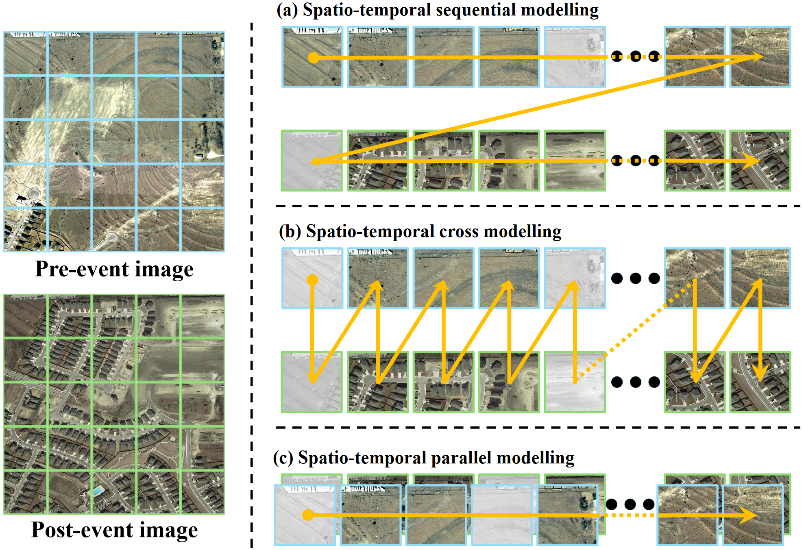

<div align="center">
<h1 align="center">ChangeMamba</h1>

<h3>ChangeMamba: Remote Sensing Change Detection with Spatio-Temporal State Space Model</h3>

[Hongruixuan Chen](https://scholar.google.ch/citations?user=XOk4Cf0AAAAJ&hl=zh-CN&oi=ao)<sup>1 #</sup>, [Jian Song](https://scholar.google.ch/citations?user=CgcMFJsAAAAJ&hl=zh-CN)<sup>1,2 #</sup>, [Chengxi Han](https://chengxihan.github.io/)<sup>3</sup>, [Junshi Xia](https://scholar.google.com/citations?user=n1aKdTkAAAAJ&hl=en)<sup>2</sup>, [Naoto Yokoya](https://scholar.google.co.jp/citations?user=DJ2KOn8AAAAJ&hl=en)<sup>1,2 *</sup>

<sup>1</sup> The University of Tokyo, <sup>2</sup> RIKEN AIP,  <sup>3</sup> Wuhan University.

<sup>#</sup> Equal contribution, <sup>*</sup> Corresponding author


[](https://ieeexplore.ieee.org/document/10565926)  [](https://arxiv.org/pdf/2404.03425.pdf)

[**Overview**](#overview) | [**Get Started**](#%EF%B8%8Flets-get-started) | [**Taken Away**](#%EF%B8%8Fresults-taken-away) | [**Common Issues**](#common-issues) | [**Others**](#q--a) | [**简体中文版**](./README_zh-CN.md)


[](https://paperswithcode.com/sota/change-detection-on-sysu-cd?p=changemamba-remote-sensing-change-detection)
[](https://paperswithcode.com/sota/change-detection-on-levir?p=changemamba-remote-sensing-change-detection)
[](https://paperswithcode.com/sota/change-detection-on-whu-cd?p=changemamba-remote-sensing-change-detection)
[](https://paperswithcode.com/sota/change-detection-on-second?p=changemamba-remote-sensing-change-detection)
[](https://paperswithcode.com/sota/2d-semantic-segmentation-on-xbd?p=changemamba-remote-sensing-change-detection)

</div>

## 🛎️Updates
* **` Notice🐍🐍`**: ChangeMamba has been accepted by [IEEE TGRS](https://ieeexplore.ieee.org/document/10565926)! We'd appreciate it if you could give this repo a ⭐️**star**⭐️ and stay tuned!!
* **` August 05th, 2024`**: ChangeMamab has been selected as [IEEE TGRS Popular Paper](https://ieeexplore.ieee.org/xpl/topAccessedArticles.jsp?punumber=36)!!
* **` July 19th, 2024`**: ChangeMamab has been selected as [IEEE GRSS Weekly Paper](https://www.linkedin.com/feed/update/urn:li:activity:7219970529498214400/)!!
* **` July 01st, 2024`**: We have uploaded the preprocessed [SECOND dataset](https://drive.google.com/file/d/1oApvN8RhJUjxO9pv6GikFbM0S4j8xXwE/view?usp=sharing
). You are welcome to use it!!
* **` June 17th, 2024`**: ChangeMamba has been accepted by [IEEE TGRS](https://ieeexplore.ieee.org/document/10565926)!!
* **` June 08th, 2024`**: [Simplified Chinese version](./README_zh-CN.md) of the README file is avaiable!!
* **` April 18th, 2024`**: We have released all weights of ChangeMamba models on BCD tasks. You are welcome [use them](#%EF%B8%8Fresults-taken-away)!!
* **` April 12th, 2024`**: The new [[arXiv](https://arxiv.org/pdf/2404.03425.pdf)] version containing new accuracy and more experiments is now online!!
* **` April 05th, 2024`**: The models and training code for MambaBCD, MambaSCD, and MambaBDA have been organized and uploaded. You are welcome to use them!!

## 🔭Overview

* [**ChangeMamba**](https://ieeexplore.ieee.org/document/10565926) serves as a strong benchmark for change detection tasks, including binary change detection (MambaBCD), semantic change detection (MambaSCD), and building damage assessment (MambaBDA). 

<p align="center">
  
</p>

* **Spatio-temporal relationship learning methods of ChangeMamba**

<p align="center">
  
</p>


## 🗝️Let's Get Started!
### `A. Installation`

Note that the code in this repo runs under **Linux** system. We have not tested whether it works under other OS.

The repo is based on the [VMama repo](https://github.com/MzeroMiko/VMamba), thus you need to install it first. The following installation sequence is taken from the VMamba repo. 

**Step 1: Clone the repository:**

Clone this repository and navigate to the project directory:
```bash
git clone https://github.com/ChenHongruixuan/MambaCD.git
cd MambaCD
```


**Step 2: Environment Setup:**

It is recommended to set up a conda environment and installing dependencies via pip. Use the following commands to set up your environment:

***Create and activate a new conda environment***

```bash
conda create -n changemamba
conda activate changemamba
```

***Install dependencies***

```bash
pip install -r requirements.txt
cd kernels/selective_scan && pip install .
```


***Dependencies for "Detection" and "Segmentation" (optional in VMamba)***

```bash
pip install mmengine==0.10.1 mmcv==2.1.0 opencv-python-headless ftfy regex
pip install mmdet==3.3.0 mmsegmentation==1.2.2 mmpretrain==1.2.0
```
### `B. Download Pretrained Weight`
Also, please download the pretrained weights of [VMamba-Tiny](https://drive.google.com/file/d/160PXughGMNZ1GyByspLFS68sfUdrQE2N/view?usp=drive_link), [VMamba-Small](https://drive.google.com/file/d/1dxHtFEgeJ9KL5WiLlvQOZK5jSEEd2Nmz/view?usp=drive_link), and [VMamba-Base](https://drive.google.com/file/d/1kUHSBDoFvFG58EmwWurdSVZd8gyKWYfr/view?usp=drive_link) and put them under 
```bash
project_path/MambaCD/pretrained_weight/
```

### `C. Data Preparation`
***Binary change detection***

The three datasets [SYSU](https://github.com/liumency/SYSU-CD), [LEVIR-CD+](https://chenhao.in/LEVIR/) and [WHU-CD](https://study.rsgis.whu.edu.cn/pages/download/building_dataset.html) are used for binary change detection experiments. Please download them and make them have the following folder/file structure:
```
${DATASET_ROOT}   # Dataset root directory, for example: /home/username/data/SYSU
├── train
│   ├── T1
│   │   ├──00001.png
│   │   ├──00002.png
│   │   ├──00003.png
│   │   ...
│   │
│   ├── T2
│   │   ├──00001.png
│   │   ... 
│   │
│   └── GT
│       ├──00001.png 
│       ...   
│   
├── test
│   ├── ...
│   ...
│  
├── train.txt   # Data name list, recording all the names of training data
└── test.txt    # Data name list, recording all the names of testing data
```

***Semantic change detection***

The [SECOND dataset](https://captain-whu.github.io/SCD/) is used for semantic change detection experiments. Please download it and make it have the following folder/file structure. Note that **the land-cover maps are RGB images in the original SECOND dataset for visualization, you need to transform them into single-channel**. Also, **the binary change maps should be generated by yourself** and put them into folder [`GT_CD`]. 

Or you are welcome to directly download and use our [preprocessed SECOND dataset](https://drive.google.com/file/d/1oApvN8RhJUjxO9pv6GikFbM0S4j8xXwE/view?usp=sharing).

```
${DATASET_ROOT}   # Dataset root directory, for example: /home/username/data/SECOND
├── train
│   ├── T1
│   │   ├──00001.png
│   │   ├──00002.png
│   │   ├──00003.png
│   │   ...
│   │
│   ├── T2
│   │   ├──00001.png
│   │   ... 
│   │
│   ├── GT_CD   # Binary change map
│   │   ├──00001.png 
│   │   ... 
│   │
│   ├── GT_T1   # Land-cover map of T1
│   │   ├──00001.png 
│   │   ...  
│   │
│   └── GT_T2   # Land-cover map of T2
│       ├──00001.png 
│       ...  
│   
├── test
│   ├── ...
│   ...
│ 
├── train.txt
└── test.txt
```

***Building damage assessment***

The xBD dataset can be downloaded from [xView 2 Challenge website](https://xview2.org/dataset). After downloading it, please organize it into the following structure: 
```
${DATASET_ROOT}   # Dataset root directory, for example: /home/username/data/xBD
├── train
│   ├── images
│   │   ├──guatemala-volcano_00000000_pre_disaster.png
│   │   ├──guatemala-volcano_00000000_post_disaster.png
│   │   ...
│   │
│   └── targets
│       ├──guatemala-volcano_00000003_pre_disaster_target.png
│       ├──guatemala-volcano_00000003_post_disaster_target.png
│       ... 
│   
├── test
│   ├── ...
│   ...
│
├── holdout
│   ├── ...
│   ...
│
├── train.txt # Data name list, recording all the names of training data
├── test.txt  # Data name list, recording all the names of testing data
└── holdout.txt  # Data name list, recording all the names of holdout data
```


### `D. Model Training`
Before training models, please enter into [`changedetection`] folder, which contains all the code for network definitions, training and testing. 

```bash
cd <project_path>/MambaCD/changedetection
```

***Binary change detection***

The following commands show how to train and evaluate MambaBCD-Small on the SYSU dataset:
```bash
python script/train_MambaBCD.py  --dataset 'SYSU' \
                                 --batch_size 16 \
                                 --crop_size 256 \
                                 --max_iters 320000 \
                                 --model_type MambaBCD_Small \
                                 --model_param_path '<project_path>/MambaCD/changedetection/saved_models' \ 
                                 --train_dataset_path '<dataset_path>/SYSU/train' \
                                 --train_data_list_path '<dataset_path>/SYSU/train_list.txt' \
                                 --test_dataset_path '<dataset_path>/SYSU/test' \
                                 --test_data_list_path '<dataset_path>/SYSU/test_list.txt'
                                 --cfg '<project_path>/MambaCD/changedetection/configs/vssm1/vssm_small_224.yaml' \
                                 --pretrained_weight_path '<project_path>/MambaCD/pretrained_weight/vssm_small_0229_ckpt_epoch_222.pth'
```

***Semantic change detection***

The following commands show how to train and evaluate MambaSCD-Small on the SECOND dataset:
```bash
python script/train_MambaSCD.py  --dataset 'SECOND' \
                                 --batch_size 16 \
                                 --crop_size 256 \
                                 --max_iters 800000 \
                                 --model_type MambaSCD_Small \
                                 --model_param_path '<project_path>/MambaCD/changedetection/saved_models' \ 
                                 --train_dataset_path '<dataset_path>/SECOND/train' \
                                 --train_data_list_path '<dataset_path>/SECOND/train_list.txt' \
                                 --test_dataset_path '<dataset_path>/SECOND/test' \
                                 --test_data_list_path '<dataset_path>/SECOND/test_list.txt'
                                 --cfg '<project_path>/MambaCD/changedetection/configs/vssm1/vssm_small_224.yaml' \
                                 --pretrained_weight_path '<project_path>/MambaCD/pretrained_weight/vssm_small_0229_ckpt_epoch_222.pth'
```

***Building Damge Assessment***

The following commands show how to train and evaluate MambaBDA-Small on the xBD dataset:
```bash
python script/train_MambaSCD.py  --dataset 'xBD' \
                                 --batch_size 16 \
                                 --crop_size 256 \
                                 --max_iters 800000 \
                                 --model_type MambaBDA_Small \
                                 --model_param_path '<project_path>/MambaCD/changedetection/saved_models' \ 
                                 --train_dataset_path '<dataset_path>/xBD/train' \
                                 --train_data_list_path '<dataset_path>/xBD/train_list.txt' \
                                 --test_dataset_path '<dataset_path>/xBD/test' \
                                 --test_data_list_path '<dataset_path>/xBD/test_list.txt'
                                 --cfg '<project_path>/MambaCD/changedetection/configs/vssm1/vssm_small_224.yaml' \
                                 --pretrained_weight_path '<project_path>/MambaCD/pretrained_weight/vssm_small_0229_ckpt_epoch_222.pth'
```
### `E. Inference Using Our/Your Weights`

Before inference, please enter into [`changedetection`] folder. 
```bash
cd <project_path>/MambaCD/changedetection
```


***Binary change detection***

The following commands show how to infer binary change maps using trained MambaBCD-Tiny on the LEVIR-CD+ dataset:

* **` Kind reminder`**: Please use [--resume] to load our trained model, instead of using [--pretrained_weight_path]. 

```bash
python script/infer_MambaBCD.py  --dataset 'LEVIR-CD+' \
                                 --model_type 'MambaBCD_Tiny' \
                                 --test_dataset_path '<dataset_path>/LEVIR-CD+/test' \
                                 --test_data_list_path '<dataset_path>/LEVIR-CD+/test_list.txt' \
                                 --cfg '<project_path>/MambaCD/changedetection/configs/vssm1/vssm_tiny_224_0229flex.yaml' \
                                 --pretrained_weight_path '<project_path>/MambaCD/pretrained_weight/vssm_tiny_0230_ckpt_epoch_262.pth'
                                 --resume '<saved_model_path>/MambaBCD_Tiny_LEVIRCD+_F1_0.8803.pth'
```

***Semantic change detection***

The following commands show how to infer semantic change maps using trained MambaSCD-Tiny on the SECOND dataset:
```bash
python script/infer_MambaBCD.py  --dataset 'SECOND'  \
                                 --model_type 'MambaSCD_Tiny' \
                                 --test_dataset_path '<dataset_path>/SECOND/test' \
                                 --test_data_list_path '<dataset_path>/SECOND/test_list.txt' \
                                 --cfg '<project_path>/MambaCD/changedetection/configs/vssm1/vssm_tiny_224_0229flex.yaml' \
                                 --pretrained_weight_path '<project_path>/MambaCD/pretrained_weight/vssm_tiny_0230_ckpt_epoch_262.pth'
                                 --resume '<saved_model_path>/[your_trained_model].pth'
```

***Building damage assessment***

The following commands show how to infer building damage assessment results using trained MambaSCD-Tiny on the xBD dataset:
```bash
python script/infer_MambaBDA.py  --dataset 'SECOND'  \
                                 --model_type 'MambaSCD_Tiny' \
                                 --test_dataset_path '<dataset_path>/xBD/test' \
                                 --test_data_list_path '<dataset_path>/xBD/test_list.txt' \
                                 --cfg '<project_path>/MambaCD/changedetection/configs/vssm1/vssm_tiny_224_0229flex.yaml' \
                                 --pretrained_weight_path '<project_path>/MambaCD/pretrained_weight/vssm_tiny_0230_ckpt_epoch_262.pth'
                                 --resume '<saved_model_path>/[your_trained_model].pth'
```


## ⚗️Results Taken Away


* *We'd appreciate it if you could give this repo a ⭐️**star**⭐️ and stay tuned.*

* *Please note that the code we uploaded was reorganised and collated. The models below were also trained using the reorganised code and therefore accuracy may not perfectly match the original paper. In most cases, the accuracy is higher than that in the paper.*

* *We also uploaded prediction results. You can download them and use them directly in your paper [[GDrive](https://drive.google.com/drive/folders/1kVKgbElM23c-hSNZ_TTqfxXNXrPgNJ6L?usp=sharing)][[BaiduYun](https://pan.baidu.com/s/1RYXRL0emsKDL_9_v82nIjQ?pwd=df2t)].*


### `A. Pretrained Weight of VMamba (Encoder)`

| Method | ImageNet (ckpt) | 
| :---: | :---: |
| VMamba-Tiny | [[GDrive](https://drive.google.com/file/d/160PXughGMNZ1GyByspLFS68sfUdrQE2N/view?usp=drive_link)][[BaiduYun](https://pan.baidu.com/s/1P9KRVy4lW8LaKJ898eQ_0w?pwd=7qxh)] |   
| VMamba-Small | [[GDrive](https://drive.google.com/file/d/1dxHtFEgeJ9KL5WiLlvQOZK5jSEEd2Nmz/view?usp=drive_link)][[BaiduYun](https://pan.baidu.com/s/1RRjTA9ONhO43sBLp_a2TSw?pwd=6qk1)]   | 
| VMamba-Base |  [[GDrive](https://drive.google.com/file/d/1kUHSBDoFvFG58EmwWurdSVZd8gyKWYfr/view?usp=drive_link)][[BaiduYun](https://pan.baidu.com/s/14_syzqwNnVB8rD3tejEZ4w?pwd=q825)] | 


### `B. Binary Change Detection`

| Method | SYSU (ckpt) | LEVIR-CD+ (ckpt) | WHU-CD (ckpt) | 
| :---: | :---: | :---: | :---: |
| MambaBCD-Tiny | [[GDrive](https://drive.google.com/file/d/1qoivh0zrZjpPzUOiIxLWZn7kdBQ-MqnY/view?usp=sharing)][[BaiduYun](https://pan.baidu.com/s/160RiqDQKB6rBwn7Fke6xFQ?pwd=wqf9)] |  [[GDrive](https://drive.google.com/file/d/1AtiXBBCoofi1e5g4STYUzBgJ1fYN4VhN/view?usp=drive_link)][[BaiduYun](https://pan.baidu.com/s/13dGC_J-wyIfoPwoPJ5Uc6Q?pwd=8ali)]	 | [[GDrive](https://drive.google.com/file/d/1ZLKXhGKgnWoyS0X8g3HS45a3X1MP_QE6/view?usp=drive_link)][[BaiduYun](https://pan.baidu.com/s/1DhTedGZdIC80y06tog1xbg?pwd=raf0)] | 
| MambaBCD-Small | [[GDrive](https://drive.google.com/file/d/1ZEPF6CvvFynL-yu_wpEYdpHMHl7tahpH/view?usp=drive_link)][[BaiduYun](https://pan.baidu.com/s/1f8iwuKCkElU9rc24_ZzXBw?pwd=46p5)]   | [[GDrive](https://drive.google.com/file/d/19jEBLheCwEnQqF23EqNrn1r79D-nZ95y/view?usp=sharing)][[BaiduYun](https://pan.baidu.com/s/1EKWp-tF0EEGgZ-nVlW8S1g?pwd=n3qz)]  | [[GDrive](https://drive.google.com/file/d/1ejiBIhSAJF0P65Xn6DpzRpARiIGPLiWw/view?usp=drive_link)][[BaiduYun]](https://pan.baidu.com/s/1tIWyfJa2o9EMwrKg-gKTnw?pwd=vizm) | 
| MambaBCD-Base |  [[GDrive](https://drive.google.com/file/d/14WbK9KjOIOWuea3JAgvIfyDvqACExZ0s/view?usp=drive_link)][[BaiduYun](https://pan.baidu.com/s/1xiWWjlhuJWA40cMggevdlA?pwd=4jft)] | [[GDrive](https://drive.google.com/file/d/1uQy5tGXW20xFZvF7hIvZvsi7-JU7tg7G/view?usp=drive_link)] [[BaiduYun](https://pan.baidu.com/s/1M_u7HdIEFIEA2d3L1kfu3Q?pwd=rkgp)] | [[GDrive](https://drive.google.com/file/d/1K7aSuT3os7LR9rUvoyVNP-x0hWKZocrn/view?usp=drive_link)][[BaiduYun](https://pan.baidu.com/s/1o6Z6ecIJ59K9eB2KqNMD9w?pwd=4mqd)] |


### `C. Semantic Change Detection`
| Method |  SECOND (ckpt) |
| :---: | :---: |
| MambaSCD-Tiny |  [[GDrive](https://drive.google.com/file/d/1Q2hMC320vCpp5MQA8SK54iFY7L5JF9qN/view?usp=sharing)][[BaiduYun](https://pan.baidu.com/s/1eHUjKm8Ty0w92BvOoj53Fw?pwd=6hnj)]  |
| MambaSCD-Small | --  | 
| MambaSCD-Base | [[GDrive](https://drive.google.com/file/d/12aJ4sL0r02-rB5K6dixtr6FGJ3kNwlFy/view?usp=sharing)][[BaiduYun](https://pan.baidu.com/s/1GxNDC2JAEvPmOiNArLrYmw?pwd=sr3i)]  | 


### `D. Building Damage Assessment`
| Method |  xBD (ckpt) | 
| :---: | :---: |
| MambaBDA-Tiny |  -- | 
| MambaBDA-Small | -- |
| MambaBDA-Base | -- |

## 🤔Common Issues
Based on peers' questions from issue, here's a quick and easy navigate list of solutions to some common issues.

| Issue | Solution | 
| :---: | :---: | 
| Issues about SECOND dataset | Please refer to Issue [#13](https://github.com/ChenHongruixuan/MambaCD/issues/13) / [#22](https://github.com/ChenHongruixuan/MambaCD/issues/22) / [#45](https://github.com/ChenHongruixuan/MambaCD/issues/45) |
| CUDA out of memory issue | Please lower the batch size of training and evalution  |
| Modify the model structure| Please refere to Issue [#44](https://github.com/ChenHongruixuan/MambaCD/issues/44)  |
NameError: name 'selective_scan_cuda_oflex' is not defined | Please refer to Issue [#9](https://github.com/ChenHongruixuan/MambaCD/issues/9)
| Question about the relationship between iteration, epoch & batch size | Please refere to Issue [#32](https://github.com/ChenHongruixuan/MambaCD/issues/32) / [#48](https://github.com/ChenHongruixuan/MambaCD/issues/48)  |


## 📜Reference

If this code or dataset contributes to your research, please kindly consider citing our paper and give this repo ⭐️ :)
```
@article{chen2024changemamba,
  author={Hongruixuan Chen and Jian Song and Chengxi Han and Junshi Xia and Naoto Yokoya},
  journal={IEEE Transactions on Geoscience and Remote Sensing}, 
  title={ChangeMamba: Remote Sensing Change Detection with Spatiotemporal State Space Model}, 
  year={2024},
  volume={62},
  number={},
  pages={1-20},
  doi={10.1109/TGRS.2024.3417253}
}
```


## 🤝Acknowledgments
This project is based on VMamba ([paper](https://arxiv.org/abs/2401.10166), [code](https://github.com/MzeroMiko/VMamba)), ScanNet ([paper](https://arxiv.org/abs/2212.05245), [code](https://github.com/ggsDing/SCanNet)), BDANet ([paper](https://ieeexplore.ieee.org/document/9442902), [code](https://github.com/ShaneShen/BDANet-Building-Damage-Assessment)). Thanks for their excellent works!!

## 🙋Q & A
***For any questions, please feel free to [contact us.](mailto:Qschrx@gmail.com)***
